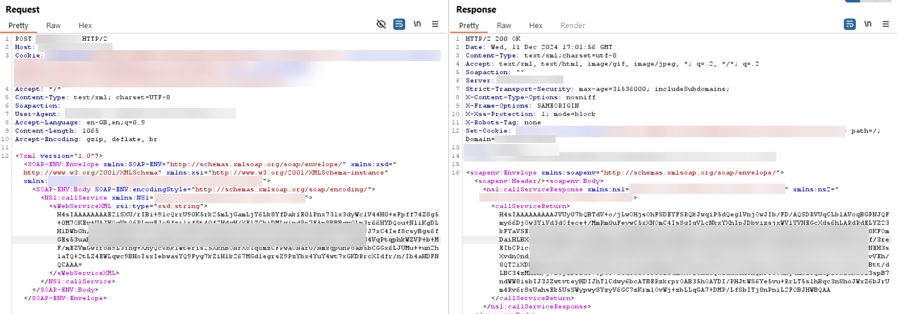
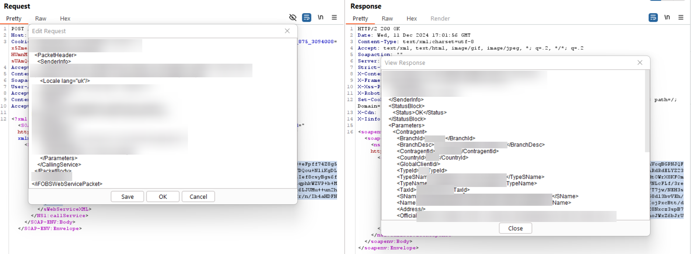

# Enhanced-Base64-Gzip-Editor

## Description

Enhanced-Base64-Gzip-Editor is a Burp Suite extension designed to streamline the decoding of Base64-encoded and gzip-compressed data. It automates the process of decoding Base64 input, extracting the gzip content, and outputting the decompressed result for efficient analysis of encoded payloads.
It takes the value in Base64, decodes it and unpacks it. Under the hood it does the following: echo 'some_value_there' | base64 -d > decoded.gz && gunzip -c decoded.gz > dec.txt

## Installation

### Pre-requirements

> [!NOTE]
> Should be installed [Jython](https://www.jython.org/download.html).

### Installation 

1. Upload [Enhanced Base64 & Gzip Editor](Enhanced_Base64_%26_Gzip_Editor.py) to Burp Extension section.
2. Or Clone this repo `git clone https://github.com/vladkoniakhin/Enhanced-Base64-Gzip-Editor.git`

## Features 

- This extension works in the Intercept and Repeater tabs.
- In the Repeater section you can modify the request (change the body), save it and send it.
- In the Response section you can view the response.
- Suppors Latin and Cyrillic characters.

## Screenshots




### Example of the code

```python
# -*- coding: utf-8 -*-
from burp import IBurpExtender, IContextMenuFactory, IHttpListener, IContextMenuInvocation
from javax.swing import JMenuItem, JOptionPane, JTextArea, JScrollPane, JButton, JPanel, JDialog
from java.util import ArrayList
from java.awt import BorderLayout, Font
import base64
import gzip
from io import BytesIO
from java.io import ByteArrayOutputStream


class BurpExtender(IBurpExtender, IContextMenuFactory, IHttpListener):
    def registerExtenderCallbacks(self, callbacks):
        self._callbacks = callbacks
        self._helpers = callbacks.getHelpers()
        callbacks.setExtensionName("Enhanced Base64 & Gzip Editor")
        callbacks.registerContextMenuFactory(self)
        callbacks.registerHttpListener(self)
<...SNIP...>
    def compress_gzip(self, data):
        with BytesIO() as byte_io:
            with gzip.GzipFile(fileobj=byte_io, mode='wb') as gz:
                gz.write(data.encode('utf-8'))
            return byte_io.getvalue()
```
