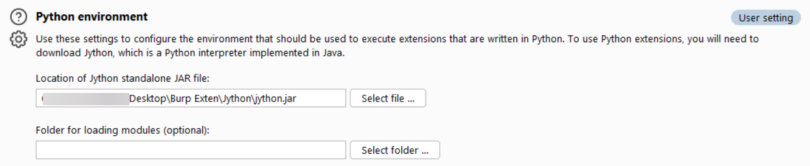
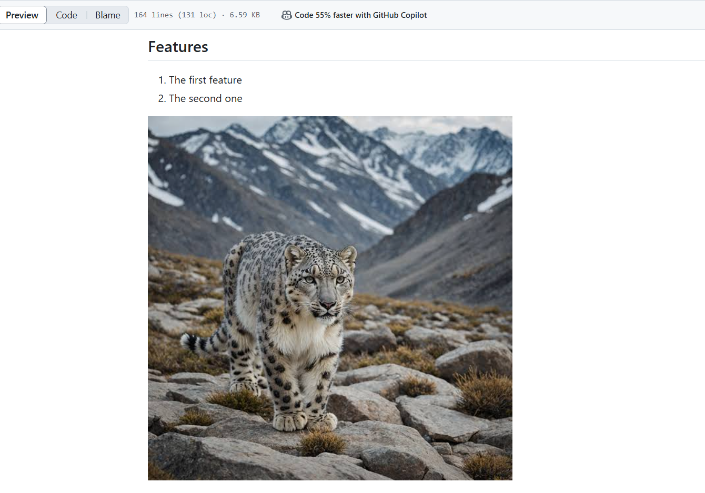

# Enhanced-Base64-Gzip-Editor

```python
# -*- coding: utf-8 -*-
from burp import IBurpExtender, IContextMenuFactory, IHttpListener, IContextMenuInvocation
from javax.swing import JMenuItem, JOptionPane, JTextArea, JScrollPane, JButton, JPanel, JDialog
from java.util import ArrayList
from java.awt import BorderLayout, Font
import base64
import gzip
from io import BytesIO
from java.io import ByteArrayOutputStream


class BurpExtender(IBurpExtender, IContextMenuFactory, IHttpListener):
    def registerExtenderCallbacks(self, callbacks):
        self._callbacks = callbacks
        self._helpers = callbacks.getHelpers()
        callbacks.setExtensionName("Enhanced Base64 & Gzip Editor")
        callbacks.registerContextMenuFactory(self)
        callbacks.registerHttpListener(self)
<...SNIP...>
    def compress_gzip(self, data):
        with BytesIO() as byte_io:
            with gzip.GzipFile(fileobj=byte_io, mode='wb') as gz:
                gz.write(data.encode('utf-8'))
            return byte_io.getvalue()
```

---

## Description(business idea)

1. Some text will be there :
- The first one
- The second one
- Relative link [Enhanced Base64 & Gzip Editor](Enhanced_Base64_%26_Gzip_Editor.py)

## Installation

### Pre-requirements

1. Install on you computer [Jython](https://www.jython.org/download.html)
2. Install 

## Features 

1. The first feature
2. The second one




> [!NOTE]
> Useful information that users should know, even when skimming content.

> [!TIP]
> Helpful advice for doing things better or more easily.

> [!IMPORTANT]
> Key information users need to know to achieve their goal.

> [!WARNING]
> Urgent info that needs immediate user attention to avoid problems.

> [!CAUTION]
> Advises about risks or negative outcomes of certain actions.

Here is a simple footnote[^1].

A footnote can also have multiple lines[^2].

[^1]: My reference.
[^2]: To add line breaks within a footnote, prefix new lines with 2 spaces.
  This is a second line.
